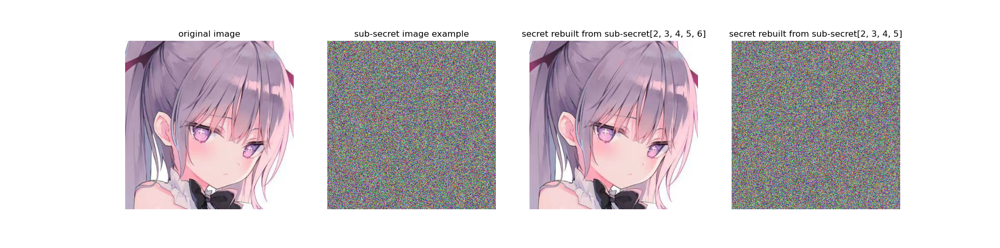
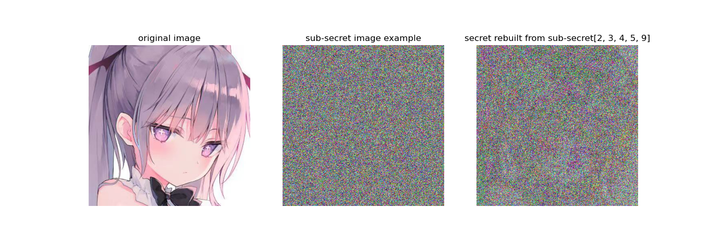
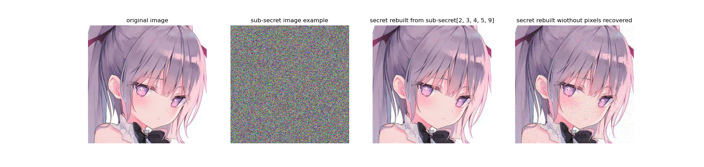

# Shamir's Secret Images Sharing
## Description
This is a simple implementation of Shamir's Secret Sharing Scheme. It is a form of secret sharing, where a secret is divided into parts, giving each participant its own unique part, where some of the parts or all of them are needed in order to reconstruct the secret.
## Usage
### Installation
Requirements:
- python 3.6+
- numpy
- PIL
- pypng

### Running
Change the secret image path, saving path, number of sub-secret images `n` and quorum in `src_256.py` or `src_257.py` to your own secret image path. Then run the following command in your terminal:

For original algorithm implementation:
```bash
python src_256.py
```
- This algorithm does not support secret rebuilding from any sub-secrets number.

For extended algorithm implementation:
```bash
python src_257.py
```
- This algorithm supports support secret rebuilding from any sub-secrets number by saving pixels index which RGB values are not in 0-255 range after Shamir's Secret Sharing algorithm.

## Examples
### Original Algorithm
- Splitting image into 10 sub-secrets and rebuilding it from 5 consecutive sub-secrets:


### Extended Algorithm
The original algorithm does not support rebuilding from any sub-secrets number. For example, if we try to rebuild the secret from 5 random sub-secrets, we will get the following result:
- Splitting image into 10 sub-secrets and rebuilding it from 5 random sub-secrets:


This is because the secret rebuilding algorithm use the Lagrange interpolation polynomial which use some division operations. If we try to rebuild the secret from 5 random sub-secrets, we will get a float number which has lose of precision. This is why we get a different result from the original image.

To solve this problem, we can times a modular inverse of 257 instead of dividing by 256. But there comes an new problem, the RGB values of the secret image are in 0-255 range. So in my extended algorithm, I save the pixels index which RGB values are not in 0-255 range after Shamir's Secret Sharing algorithm in a `tExt` chunk for all PNG sub-secret image. Then we can recover those pixels by using the index wrote in `tExt` chunk. 

The following is the result of rebuilding the secret from 5 random sub-secrets:
- Splitting image into 10 sub-secrets and rebuilding it from 5 random sub-secrets:
